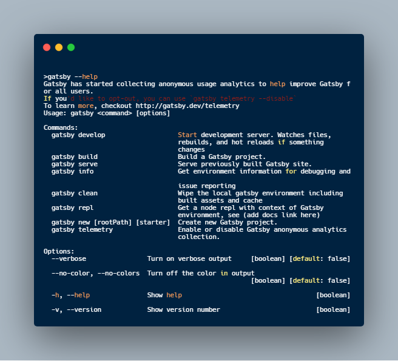

## Introduction

Welcome to the Gatsby Tutorial! We're excited you're here.

Before you start building your first Gatsby site, you’ll need to familiarize
yourself with some core web technologies and make sure that you have installed
all required software tools.

By the end of this part of the Tutorial, you will:

- Have a basic understanding of the key technologies needed to create a Gatsby
  site.
- Install all the required software tools.
- Create all the necessary accounts for deploying your site online.

## Background Knowledge

The Tutorial is intended to be as approachable as possible for people who are
new to Gatsby and React. With that said, if you are brand new to web development
(welcome!), you might find it helpful to learn some fundamentals first.

- **HTML**: A markup language that every web browser is able to understand. It
  stands for HyperText Markup Language. You use HTML to add structure to your
  web content, defining things like headings, paragraphs, and more.
  - Learn more about HTML with the
    [Basic HTML and HTML5 course on freeCodeCamp](https://www.freecodecamp.org/learn/responsive-web-design/#basic-html-and-html5).
- **CSS**: A presentational language used to style the appearance of your web
  content (fonts, colors, layout, etc). It stands for Cascading Style Sheets.
  - Learn more about CSS with the
    [Basic CSS course on freeCodeCamp](https://www.freecodecamp.org/learn/responsive-web-design/#basic-css).
- **JavaScript**: A programming language that lets you make your web content
  dynamic and interactive.
  - In this Tutorial you will use the following concepts: creating and using
    variables, destructuring objects and arrays, arrow functions, array methods
    like `.map()`.
  - Learn more about JavaScript with the
    [Basic JavaScript course on freeCodeCamp](https://www.freecodecamp.org/learn/javascript-algorithms-and-data-structures/#basic-javascript).
- The **command line**: The command line is a text-based interface used to run
  commands on your computer. You’ll also often see it referred to as the
  **terminal**. In this tutorial, we’ll use both interchangeably.
  - If you’re new to the command line, "running" a command, means "writing a
    given set of instructions in your command prompt, and hitting the Enter
    key". Commands will be shown in a highlighted box, something like
    `node --version`, but not every highlighted box is a command! If something
    is a command it will be mentioned as something you have to run/execute.
  - The instructions for how to use the command line differ slightly based on
    what operating system your computer uses:
    - [Command line instructions for Mac](https://www.macworld.co.uk/feature/mac-software/how-use-terminal-on-mac-3608274/)
    - [Command line instructions for Windows](https://www.lifewire.com/how-to-open-command-prompt-2618089)
    - [Command line instructions for Linux](https://www.howtogeek.com/140679/beginner-geek-how-to-start-using-the-linux-terminal/).

In addition to the ones listed above, Gatsby uses a few more technologies under
the hood. The Tutorial will teach you everything you need to know about the
following tools. But if you're interested in getting a head start, here's a bit
more information:

- **React**: A code library (built with JavaScript) for building user
  interfaces. It’s the framework that Gatsby uses to build pages and structure
  content.
  - Learn more about React with the
    [React course on freeCodeCamp](https://www.freecodecamp.org/learn/front-end-libraries/#react).
- **GraphQL**: A query language that allows you to pull data into your website.
  It’s the interface that Gatsby uses for managing site data.
  - Learn more about GraphQL with the
    [How to GraphQL tutorial](https://www.howtographql.com/).

## Installation Guide

The rest of this part of the Tutorial walks you through how to install the
following tools:

- [Node.js](#nodejs) (v12.13 or newer)
- [Git](#git)
- [Gatsby command line interface (CLI)](#gatsby-cli) (v3 or newer)
- [Visual Studio Code](#vs-code)

### Node.js

[Node.js](https://nodejs.dev/learn) is an environment that can run JavaScript
code outside of a web browser. Gatsby is built with Node.js. To get up and
running with Gatsby, you’ll need to have Node.js version 12.13 (or newer)
installed on your computer.

[npm](https://docs.npmjs.com/getting-started/what-is-npm) is a package manager
that comes bundled with Node.js. You'll use the npm command line interface to
add packages to your site (like Gatsby plugins) and to run command line tasks
(like starting up your site).

Follow the installation instructions below, based on your computer's operating
system. (Click the header to expand the section.)

### Git

Git is a free and open source distributed version control system. It's a tool
that helps you save different versions of your code. It also helps teammates
work together on the same codebase at the same time.

When you create a new Gatsby site, Gatsby uses Git behind the scenes to download
and install the required files for your new site. You will also use Git to push
your code to the cloud, so that you can deploy your site on the internet for
others to see.

The steps to download and install Git depend on your operating system. Follow
the guide for your system:

- [Install Git on macOS](https://www.atlassian.com/git/tutorials/install-git#mac-os-x)
- [Install Git on Windows](https://www.atlassian.com/git/tutorials/install-git#windows)
- [Install Git on Linux](https://www.atlassian.com/git/tutorials/install-git#linux)

### Gatsby CLI

The Gatsby command line interface (CLI) is a tool that lets you quickly create
new Gatsby-powered sites and run commands for developing Gatsby sites.

The CLI is a published npm package, which means you can install it using npm.

Install the Gatsby CLI globally by running the command below. (Have an older
version of the Gatsby CLI installed? This command will also update you to the
latest version.)

```shell
npm install -g gatsby-cli
```

Check that you have the correct version installed by running the command below.
You should be on v3 or newer.

```shell
gatsby --version
```

See the available commands:

```shell
gatsby --help
```



### Visual Studio Code

Visual Studio Code (also called VS Code, for short) is a popular code editor
that you can use to write code for your project. If you don't have a preferred
code editor yet, visit the
[VS Code site](https://code.visualstudio.com/#alt-downloads) and download the
version appropriate for your platform.

It doesn't matter what code editor you choose to use. Your site will end up
looking the same, no matter what tool you use to write it. But the Gatsby
documentation sometimes includes screenshots that were taken in VS Code, so
using VS Code will make sure that your screen looks like the screenshots in the
tutorial and docs.

## Account Creation

The final step in this part of the tutorial is to create accounts for the online
platforms you will need to deploy your site online for others to see.

In this Tutorial, you will deploy your site using Gatsby Cloud. To use Gatsby
Cloud, you will need to set up a GitHub account and a Gatsby Cloud account.
(Both accounts are free!)

- [Create a GitHub account.](https://github.com/join) GitHub is a website for
  storing your Git codebases (also called Git repositories).
- [Create a Gatsby Cloud account.](/dashboard/signup/) Gatsby Cloud is a
  platform designed to be the best way to build and deploy your Gatsby sites.

## Summary

Now that you have all the knowledge and tools you'll need, you're ready for the
Tutorial!

### What's coming next?

In Part 1 of the Tutorial, you'll create your first Gatsby site and deploy it
online for everyone to see.
